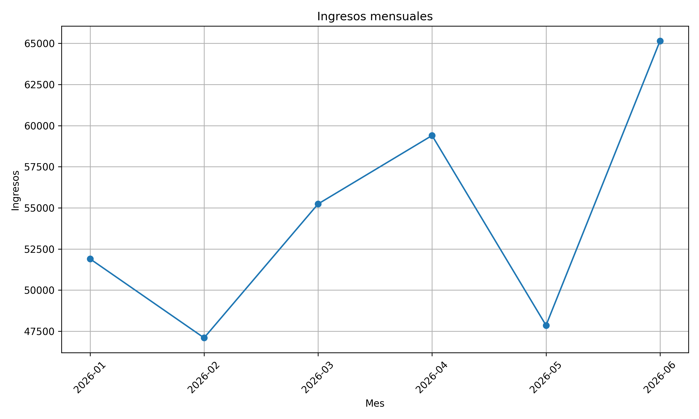
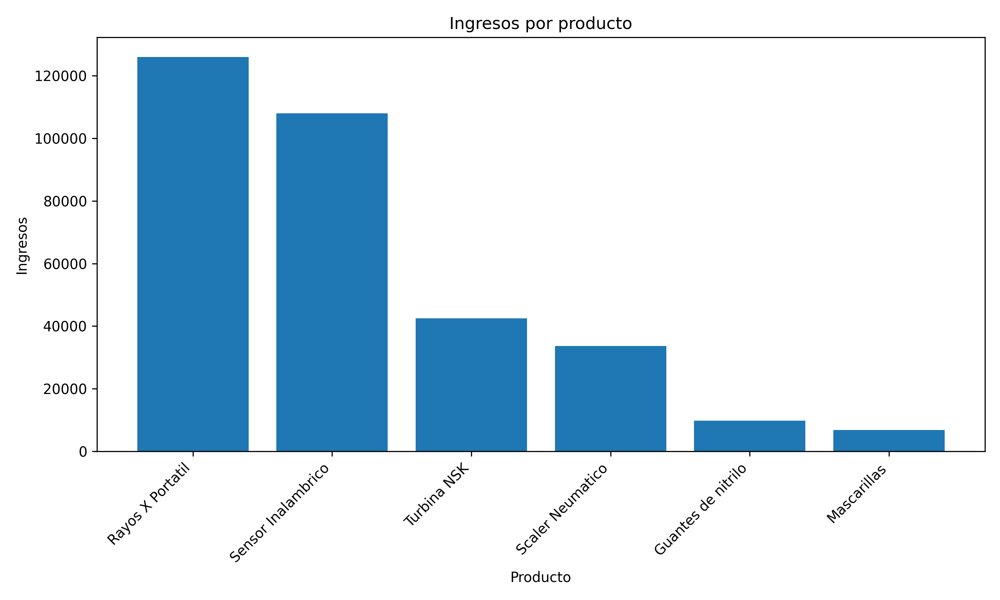
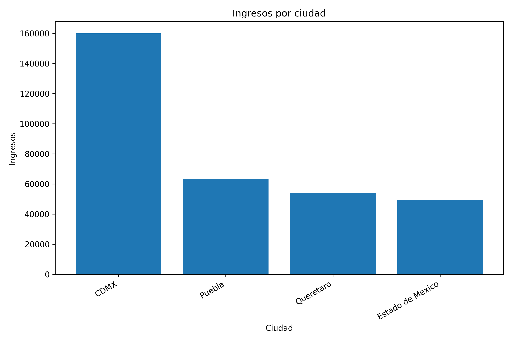
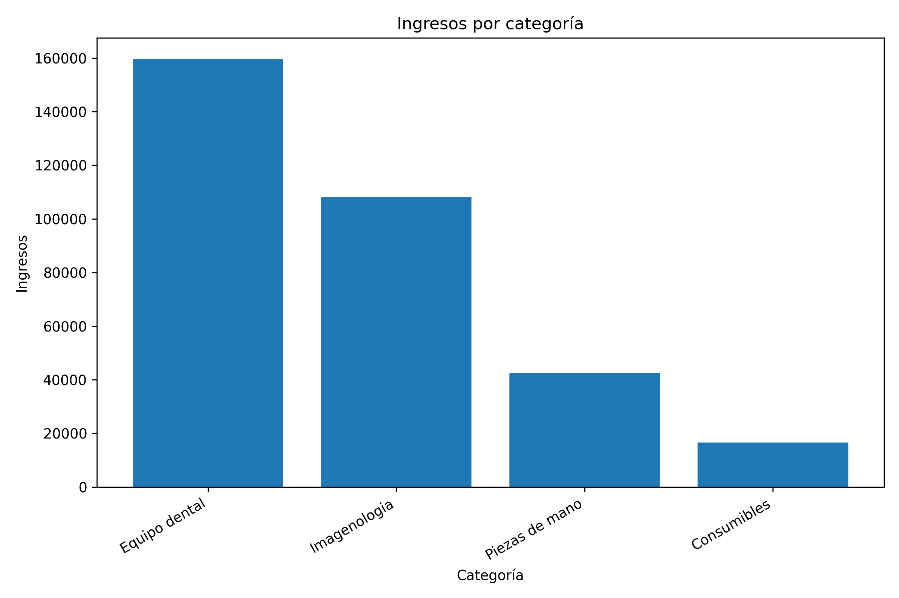
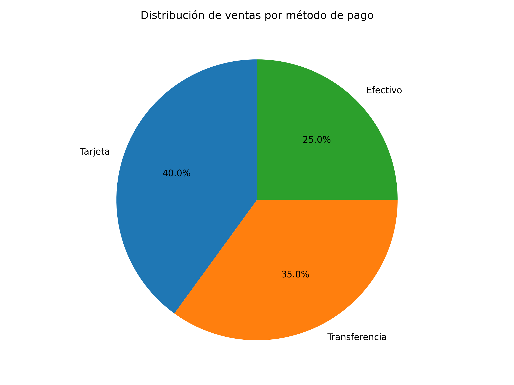

# Análisis de ventas con Python y SQL

Proyecto de análisis de datos que simula las ventas de una empresa de productos dentales.

El objetivo es construir un flujo completo de procesamiento de datos utilizando Python, Pandas, SQLite, SQL y Matplotlib.

## Objetivos

- Explorar y validar un dataset de ventas.
- Limpiar y transformar los datos con Pandas.
- Crear una base de datos SQLite.
- Ejecutar consultas SQL para obtener indicadores.
- Generar gráficas automáticamente.
- Exportar reportes en formato CSV.

## Tecnologías utilizadas

- Python
- Pandas
- SQL
- SQLite
- Matplotlib
- Git y GitHub

## Estructura del proyecto

```text
sales-analysis-python-sql
│
├── data
│   ├── ventas.csv
│   └── ventas_limpias.csv
│
├── database
│   └── ventas.db
│
├── images
│   ├── ingresos_mensuales.png
│   ├── ingresos_por_categoria.png
│   ├── ingresos_por_ciudad.png
│   ├── ingresos_por_producto.png
│   └── ventas_por_metodo_pago.png
│
├── python
│   ├── explorar_datos.py
│   ├── limpiar_datos.py
│   ├── crear_base_datos.py
│   ├── analisis_sql.py
│   ├── generar_graficas.py
│   └── generar_reportes.py
│
├── reports
│   ├── kpis_generales.csv
│   ├── reporte_ciudades.csv
│   ├── reporte_mensual.csv
│   └── reporte_productos.csv
│
├── sql
│   └── consultas.sql
│
├── .gitignore
├── main.py
├── README.md
└── requirements.txt
```

## Flujo del proyecto

```text
ventas.csv
    ↓
Exploración de datos
    ↓
Limpieza y transformación
    ↓
ventas_limpias.csv
    ↓
Base de datos SQLite
    ↓
Consultas SQL
    ↓
Gráficas y reportes
```

## Transformaciones realizadas

Durante el proceso de limpieza se realizaron las siguientes acciones:

- Conversión de la columna `fecha` al tipo fecha.
- Eliminación de registros duplicados.
- Eliminación de espacios innecesarios.
- Validación de valores nulos.
- Creación de la columna `total_venta`.

La columna se calcula con la siguiente fórmula:

```text
total_venta = precio_unitario × cantidad
```

## Análisis realizados

El proyecto permite conocer:

- Ingresos totales.
- Número de ventas.
- Unidades vendidas.
- Ticket promedio.
- Producto con mayores ingresos.
- Ventas por ciudad.
- Ventas por categoría.
- Distribución por método de pago.
- Evolución mensual de los ingresos.

## Consultas SQL

Ejemplo de consulta utilizada para analizar los ingresos por producto:

```sql
SELECT
    producto,
    SUM(cantidad) AS unidades_vendidas,
    ROUND(SUM(total_venta), 2) AS ingresos
FROM ventas
GROUP BY producto
ORDER BY ingresos DESC;
```

## Visualizaciones

### Ingresos mensuales



### Ingresos por producto



### Ingresos por ciudad



### Ingresos por categoría



### Ventas por método de pago



## Cómo ejecutar el proyecto

### 1. Clonar el repositorio

```bash
git clone URL-DEL-REPOSITORIO
```

### 2. Entrar a la carpeta

```bash
cd sales-analysis-python-sql
```

### 3. Crear el entorno virtual

En Windows:

```bash
py -m venv venv
```

### 4. Activar el entorno virtual

En PowerShell:

```powershell
.\venv\Scripts\Activate.ps1
```

### 5. Instalar dependencias

```bash
pip install -r requirements.txt
```

### 6. Ejecutar el proyecto completo

```bash
py main.py
```

## Archivos generados

El proyecto genera automáticamente:

- Una base de datos SQLite.
- Un archivo CSV con los datos limpios.
- Reportes por producto, ciudad y mes.
- Un resumen de KPIs.
- Cinco visualizaciones en formato PNG.

## Aprendizajes demostrados

Este proyecto demuestra conocimientos de:

- Manipulación de datos con Pandas.
- Automatización de procesos con Python.
- Diseño y uso de bases de datos SQLite.
- Creación de consultas SQL.
- Generación de indicadores de negocio.
- Visualización de datos.
- Organización y documentación de proyectos.

## Autora

**Vita Mijangos**

Estudiante de Ingeniería en Sistemas Computacionales con interés en análisis de datos, Business Intelligence y desarrollo tecnológico.